# Multi-Area OSPF with ACL-Based Security Policies

Extension of the [`multi-area-ospf-cost-manipulation`](https://github.com/is-fishy/multi-area-ospf-cost-manipulation) lab. This project layers standard and extended ACLs on top of a working 3-router multi-area OSPF topology to enforce per-department access policies to a shared server, without breaking OSPF adjacencies or inter-area routing.


## Topology

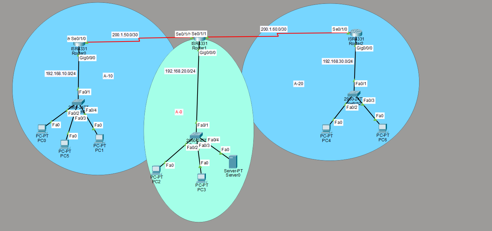

| Router | Role | Area(s) | LAN Subnet |
|---|---|---|---|
| SALES-Router | Area Border Router (Sales) | 0, 10 | 192.168.10.0/24 |
| IT-Router | Backbone / Area Border Router | 0, 10, 20 | 192.168.20.0/24 |
| GUESTS-Router | Area Border Router (Guest) | 0, 20 | 192.168.30.0/24 |

**WAN links:**
- SALES-Router ↔ IT-Router: `200.1.50.0/30`
- IT-Router ↔ GUESTS-Router: `200.1.60.0/30`

**Area 0 (backbone)** hosts the shared resources: `Server0` (192.168.20.4) plus PC2 and PC3, all with unrestricted access to the rest of the network. IT-Router sits at the center of the topology and touches all three areas, making it the natural place to verify multi-area convergence.

## IP Addressing Summary

| Area | Network | Devices |
|---|---|---|
| A-10 (Sales) | 192.168.10.0/24 | PC0, PC1, PC5 |
| A-0 (IT / Backbone) | 192.168.20.0/24 | PC2, PC3, Server0 (192.168.20.4) |
| A-20 (Guest) | 192.168.30.0/24 | PC4, PC6 |

## OSPF Verification

Before layering ACLs on top, adjacencies and inter-area routes were confirmed to ensure the ACLs don't accidentally block OSPF hellos/updates.

| Router | Neighbor(s) | State |
|---|---|---|
| SALES-Router | IT-Router (200.1.50.2) | FULL |
| IT-Router | SALES-Router (200.1.50.1), GUESTS-Router (200.1.60.2) | FULL |
| GUESTS-Router | IT-Router (200.1.60.1) | FULL |

**OSPF neighbor tables:**

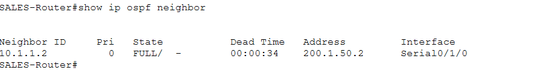
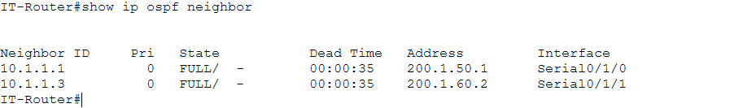
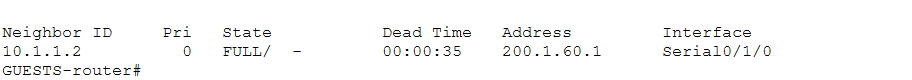

**Inter-area route tables** (confirm `O IA` routes for remote LANs):

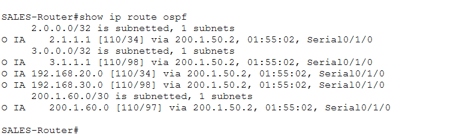
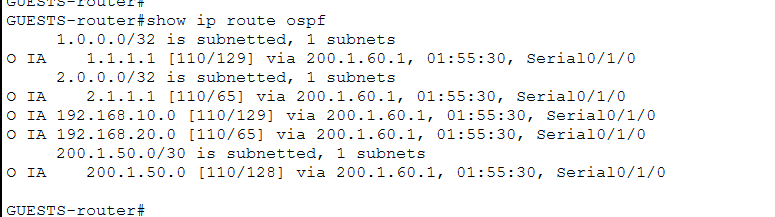

**Interface-to-area mapping** (confirms area assignment per interface matches the diagram):

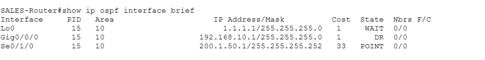
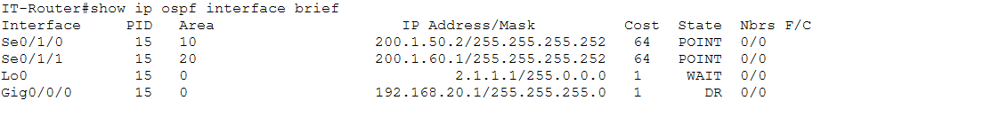
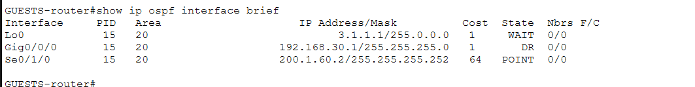

## Security Policy Goals

| Source | Allowed | Denied |
|---|---|---|
| Sales LAN (192.168.10.0/24) | ICMP, FTP, HTTP, DNS to Server0 | SSH to IT-Router (192.168.20.1) |
| Guest LAN (192.168.30.0/24) | ICMP, HTTP, DNS to Server0 | FTP to Server0, all other access to 192.168.10.0/24 and 192.168.20.0/24 |
| Area 0 (IT LAN) | Full, unrestricted | — (trusted zone, no ACL applied) |

## Sales Router — Extended ACL 110

Applied **inbound** on `Gig0/0/0` (traffic entering from the Sales LAN).

```
access-list 110 permit ospf any any
access-list 110 permit icmp any any
access-list 110 permit tcp 192.168.10.0 0.0.0.255 host 192.168.20.4 eq ftp
access-list 110 deny   tcp 192.168.10.0 0.0.0.255 host 192.168.20.1 eq 22
access-list 110 permit udp 192.168.10.0 0.0.0.255 host 192.168.20.4 eq domain
access-list 110 permit tcp 192.168.10.0 0.0.0.255 host 192.168.20.4 eq www
access-list 110 permit ip any any
```

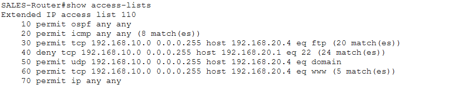
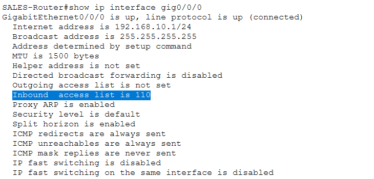

### Sales Test Results

| Test | From | To | Expected | Result |
|---|---|---|---|---|
| Ping | PC0/PC5 | 192.168.20.4 | Success | ✅ |
| FTP | PC0 | 192.168.20.4 | Success | ✅ |
| HTTP | PC0 | 192.168.20.4 | Success | ✅ |
| DNS resolution | PC5 | `ftp.fileserver.com` | Resolves to 192.168.20.4 | ✅ |
| SSH | PC0 | 192.168.20.1 | Denied (timeout) | ✅ |

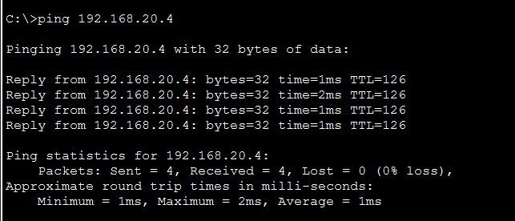
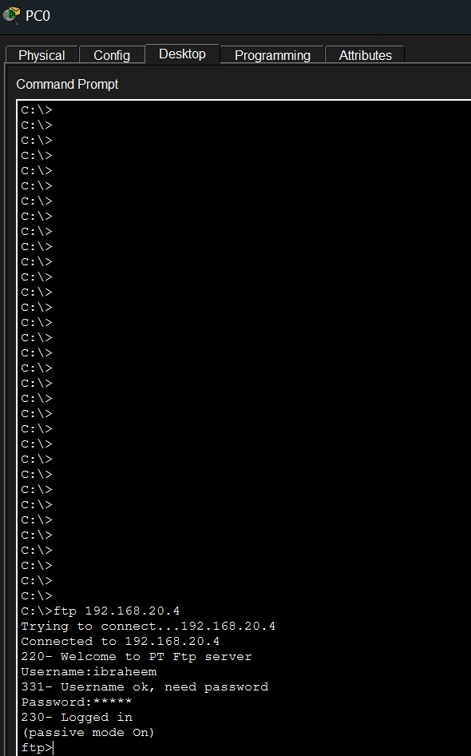
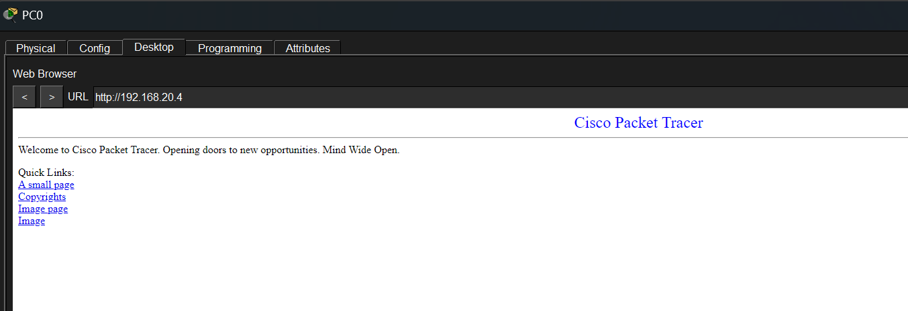
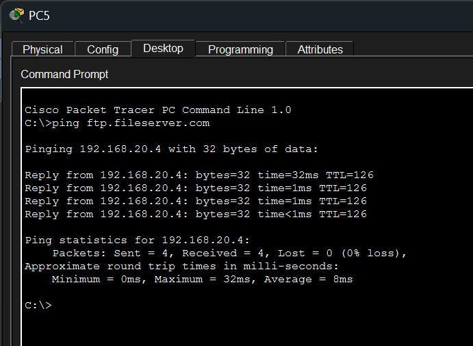
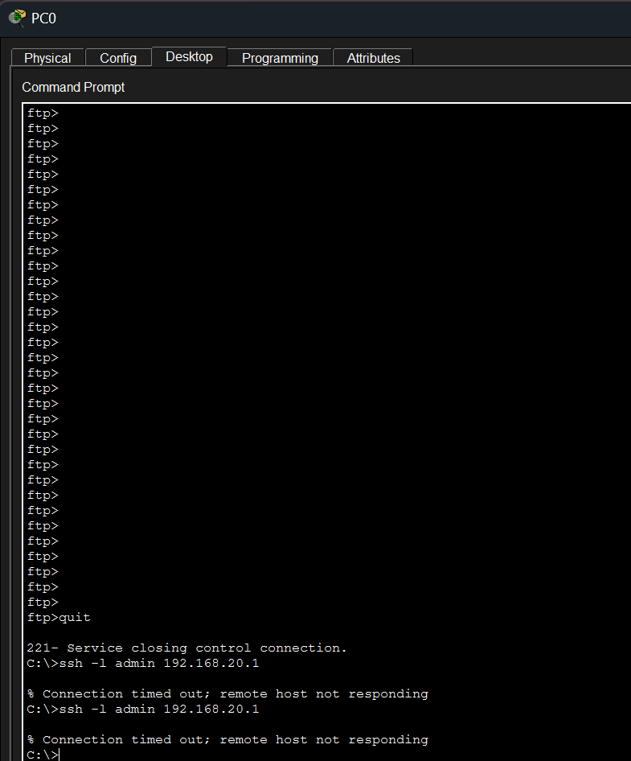

`show access-lists` on SALES-Router confirms the deny line is actually being hit (non-zero match count) after the SSH attempt — visible in the ACL config screenshot above.

## Guest Router — Extended ACL 120

Applied **inbound** on `Gig0/0/0` (traffic entering from the Guest LAN).

```
access-list 120 permit ospf any any
access-list 120 permit icmp any any
access-list 120 permit tcp 192.168.30.0 0.0.0.255 host 192.168.20.4 eq www
access-list 120 permit udp 192.168.30.0 0.0.0.255 host 192.168.20.4 eq domain
access-list 120 deny   ip 192.168.30.0 0.0.0.255 192.168.10.0 0.0.0.255
access-list 120 deny   ip 192.168.30.0 0.0.0.255 192.168.20.0 0.0.0.255
access-list 120 permit ip any any
```

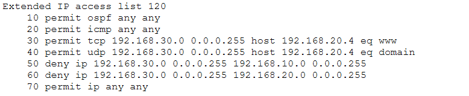
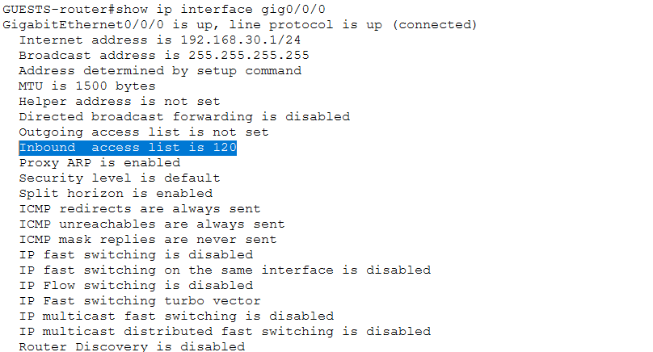

Note: FTP is not explicitly permitted, so Guest traffic to Server0 on the FTP port falls through to the blanket deny on `192.168.20.0/24` (line 60) — while HTTP and DNS are permitted earlier in the list and match before that deny is reached.

### Guest Test Results

| Test | From | To | Expected | Result |
|---|---|---|---|---|
| Ping | PC4 | 192.168.20.4 | Success | ✅ |
| HTTP | PC4 | 192.168.20.4 | Success | ✅ |
| DNS resolution | PC4 | `ftp.fileserver.com` | Resolves to 192.168.20.4 | ✅ |
| FTP | PC4 | 192.168.20.4 | Denied (timeout) | ✅ |

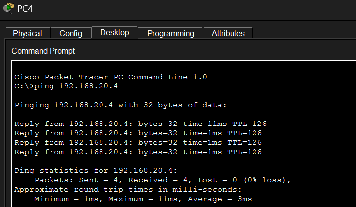
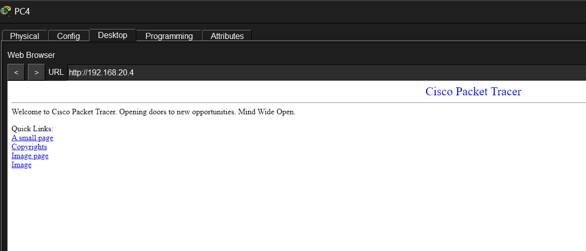
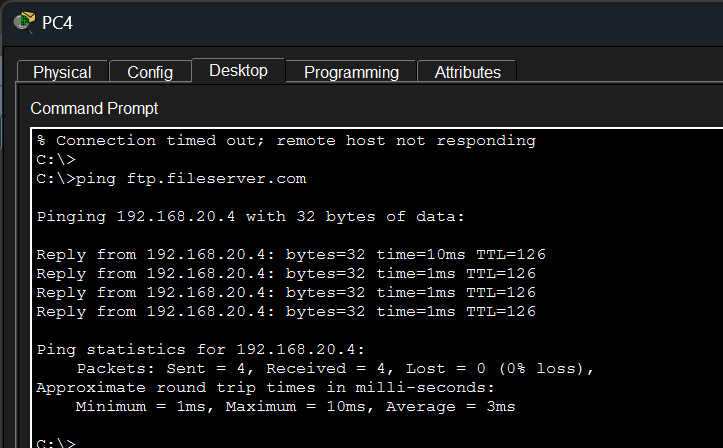
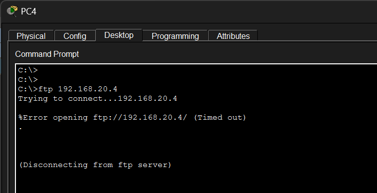

## Area 0 — Trusted Zone Baseline

No ACL is applied on the IT-Router's LAN-facing interface. PC2/PC3 have full, unrestricted reachability to both remote LANs, confirming the restrictions above are specific to Sales and Guest, not a network-wide fault.

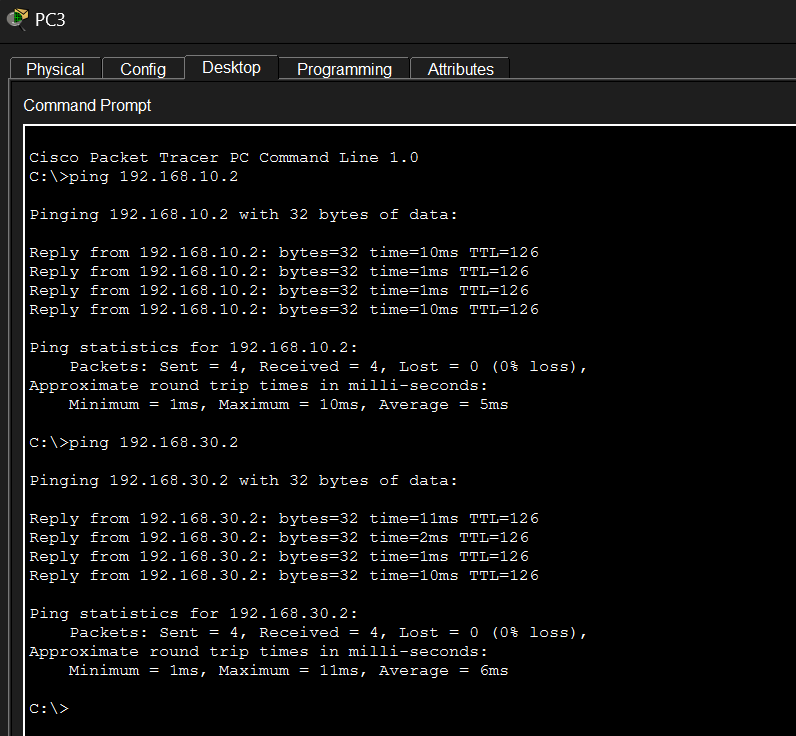

## Server Configuration (Server0 — 192.168.20.4)

| Service | Status |
|---|---|
| FTP | On — user `ibraheem`, RW permissions |
| HTTP/HTTPS | On |
| DNS | On — A record `ftp.fileserver.com` → 192.168.20.4 |

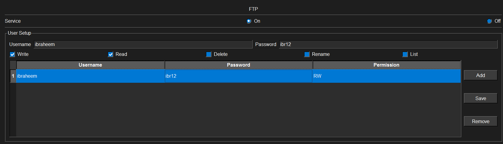
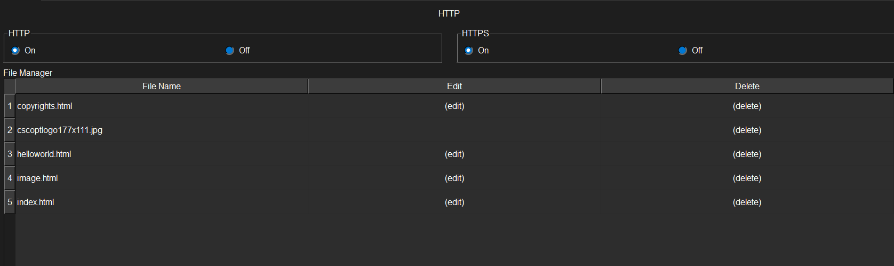
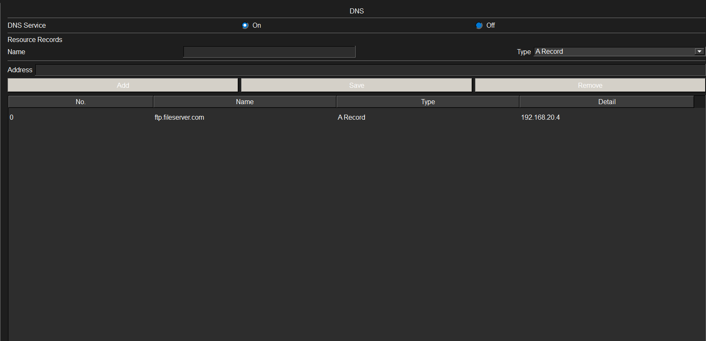

## Key Takeaways

- Extended ACLs can enforce granular, protocol-specific department policies (e.g., Sales gets FTP but not SSH; Guest gets HTTP but not FTP) without disrupting OSPF adjacencies, as long as `permit ospf any any` is placed before any denies.
- Placing `permit icmp any any` early keeps ping usable for troubleshooting even under a restrictive policy.
- ACL line order matters: broader deny statements placed after specific permits (as in ACL 120) allow selective exceptions before the blanket block takes effect.
- `show ip interface <int>` and `show access-lists` (with match counters) are the fastest way to verify an ACL is both applied and actually being triggered by real traffic.

## Related Repositories

- [`multi-area-ospf-cost-manipulation`](https://github.com/is-fishy/multi-area-ospf-cost-manipulation) — base OSPF topology this project extends

## 👤 Author

Ibraheem

## 📄 License

This project is for educational purposes. Feel free to use or modify it for your own learning.
